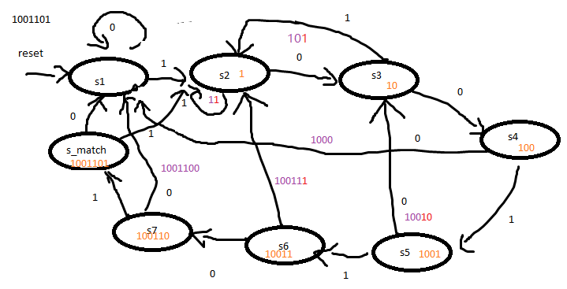

# 12状态机

# 笔记
1. 摩尔状态机,米利状态机
2. 独热码(one-hot)

```
// parameter
// origin
localparam  S_IDLE = 2'd0;
localparam  S_START = 2'd1;
localparam  S_stop = 2'd2;
localparam  S_CLEAR = 2'd3;
reg[1:0] state;

// one-hot code
localparam  S_IDLE = 4'b0001;
localparam  S_START = 4'b0010;
localparam  S_stop = 4'b0100;
localparam  S_CLEAR = 4'b1000;
reg [3:0]  state;

```
3. 两段式状态机
> 一段描述状态变化,另一段描述信号输出
4. 三段式状态机
> 待补充

5. 波形检测1001101(纯练习,无实际应用价值)

