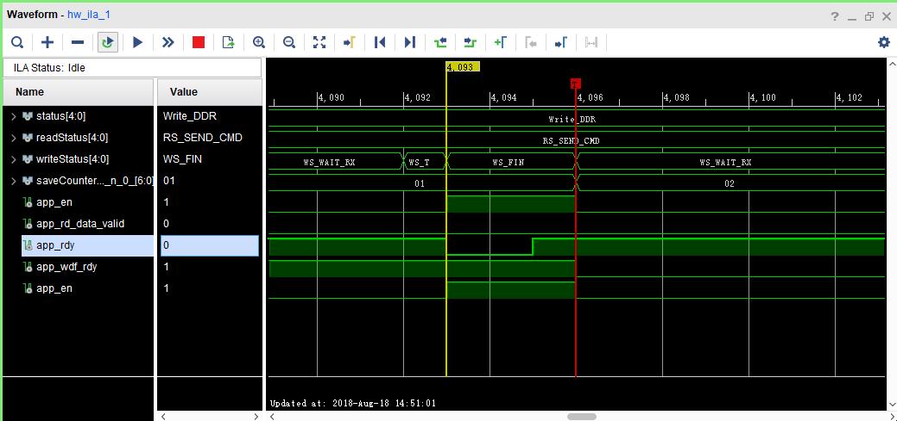

# ddr3 Vivado

1. 带有`BUFG`的时钟输出不能直接output(主要是pll输出的时钟)
2. 使用setup debug功能时,如果时钟线被优化,则无法在硬件界面生成debug模块,可以考虑使用`ila`ip核实现相应功能

> 个人感觉`ila`更加灵活一些,但是要写代码,图形化界面的debug貌似只能采用bufg中的时钟(这点需要多验证)

3. 米联客fpga散热应该有问题,ddr3客服回应温度80摄氏度,实际测试70摄氏度加风扇可以维持在60度左右
4. ddr3 ip核如果在输入时钟选择`no buffer`,并使用`IBUFG`语句建立bufg则可能导致功耗计算出现四十多瓦的情况
5. vivado每次编译时间很长,利用tcl文件配合聊天工具api或webhook可以实现提醒功能.
6. ~~如果在app_rdy信号为低时对ddr进行操作,则会导致app_wdf_rdy被永久拉低~~

~~这个错误让我找了两天,表现为程序随机运行一段时间后无法继续运行~~

现在依旧有bug
